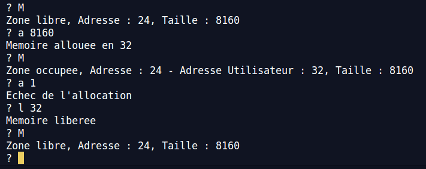
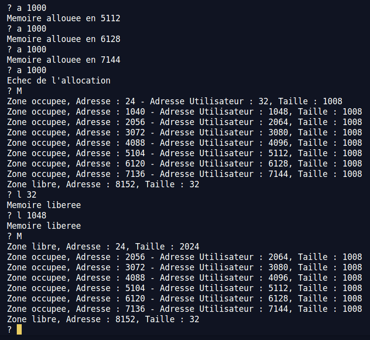

*Réalisé par DEL MEDICO Rémi - Horlaville Albin - MIRAS Romain*

# Compte Rendu TP Allocateur Mémoire

Ce document à pour d'expliquer les choix de conception et d'implémentation de notre allocateur mémoire en C.

## Explication de la conception

Ci-dessous les schémas de notre implémentation. La mémoire est organisée en Free Blocks (espace mémoire libre) et en zone occupée. Les Free Blocks sont reliés entre eux par une liste chainée dont l’adresse de la tête est stockée dans FIRST, une métadonnée du HEAD de la zone mémoire globale. Cette structure nous permet de parcourir facilement les Free Blocks. Nous utilisons une structure pour crée et accéder facilement aux Free Blocks. Ainsi chaque zone libre possède deux métadonnées : la première qui renseigne sa taille (Le nombre ne prend pas en compte la mémoire utilisée pour stocker les deux métadonnées) et la seconde qui est un pointeur vers le prochain Free Block. Les zones occupées n’ont qu’une seule métadonnée, leur taille. En pratique les zones occupées sont des Free Blocks solitaires de la liste chainée, et l’emplacement mémoire du pointeur est ignoré et considéré comme données utilisateurs.

## Les implémentations

Pour la fonction mem_show, l’algorithme consiste à afficher le contenu de la mémoire tant que celle-ci ne correspond pas à un Free Block et quand c’est le cas, d’aller directement à la fin de celle-ci et recommencer. La fonction mem_init initialise le HEAD global et crée le premier Free Block dont la taille correspond à l’espace global de mémoire que l’on a choisie moins la place que prend le HEAD et la métadonnée size. Nous avons codé une fonction get_fb_prev(fb) qui prend en paramètre un Free Block et renvoie le précédent dans la chaine ou NULL si c’est la tête. Nous l’utilisons dans les fonctions mem_alloc et mem_free. 

De plus, tout les fits ont été implémenté : first, best et worst

Pour les tests, nous avons utiliser memshell. Voici plusieurs jeux de tests :

### Test 1

### Test 2

